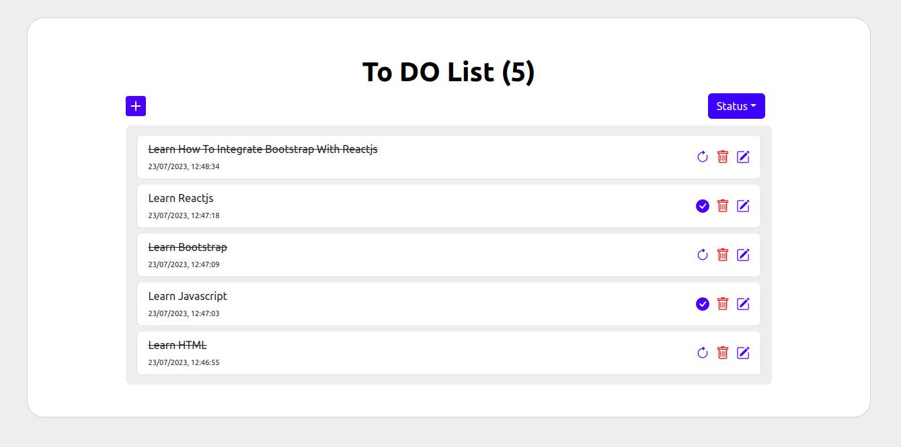

# React-todo-list-app (Formik,Yup,Bootstrap,Toast, localstorage)

Todo list application developed in react using functional components and bootstrap.  
<ul>
<li><b>Create new</b> task item.</li>
<li><b>Edit</b> existing task item.</li> 
<li><b>Delete</b> existing task item.</li> 
<li><b>Flag</b> task as completed.</li>
<li>Remove completed flag and bring back to in progress.</li>
<li>Displaying success messages using <b>Toast</b></li> 
<li><b>Filter</b> the tasks based on status (completed / incomplete / all)</li>
<li><b>Localstorage</b> is used to remember your tasks</li> 
</ul>

## Live app on stackblitz 

[https://stackblitz.com/edit/react-todo-app-bootstrap?file=src%2FApp.js](https://stackblitz.com/edit/react-todo-app-bootstrap?file=src%2FApp.js)

# Kickstart

1. checkout the repository
2. cd app
3. npm install
4. npm start

## Demo - Todo manager

## Demo - screenshot

